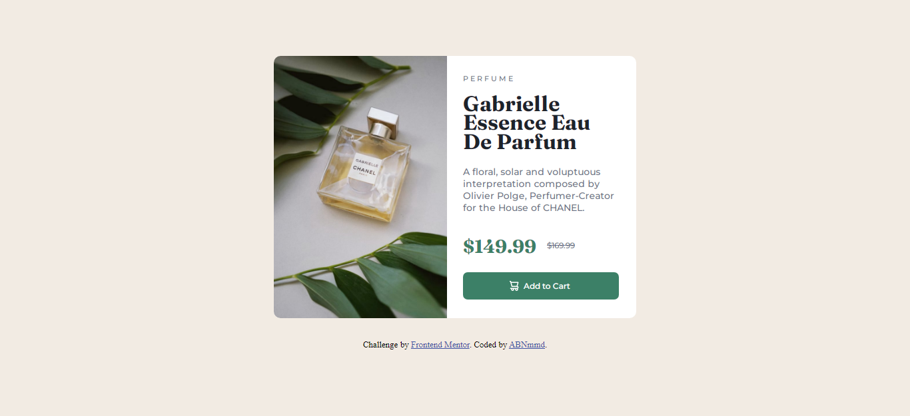

# Frontend Mentor - Product preview card component solution

This is a solution to the [Product preview card component challenge on Frontend Mentor](https://www.frontendmentor.io/challenges/product-preview-card-component-GO7UmttRfa). Frontend Mentor challenges help you improve your coding skills by building realistic projects. 

## Table of contents

- [Overview](#overview)
  - [The challenge](#the-challenge)
  - [Screenshot](#screenshot)
- [My process](#my-process)
  - [Built with](#built-with)
  - [What I learned](#what-i-learned)
  - [Useful resources](#useful-resources)
- [Author](#author)

## Overview

### The challenge

Users should be able to:

- View the optimal layout depending on their device's screen size
- See hover and focus states for interactive elements

### Screenshot




## My process

### Built with

- Semantic HTML5 markup
- CSS custom properties
- Flexbox
- CSS Grid

### What I learned

I learned how to set an icon position to be aligned with the text next to it, using: 
```CSS
.card .content .btn > img {
    position: relative;
    top: 3px;
    right: 4px;
}
```
And the way to use the picture element in HTML:
```html
      <picture>
        <source class="img1" media="(max-width: 545px)" srcset="./images/image-product-mobile.jpg">
        <source class="img2" media="(min-width: 546px)" srcset="./images/image-product-desktop.jpg">
        
      </picture>
```

### Useful resources

- [developer mozilla](https://developer.mozilla.org/en-US/docs/Web/CSS/grid-template-areas?retiredLocale=ar)
- [w3schools](https://www.w3schools.com/html/html_images_picture.asp)

## Author

- Frontend Mentor - [@ABNmmd](https://www.frontendmentor.io/profile/ABNmmd)
